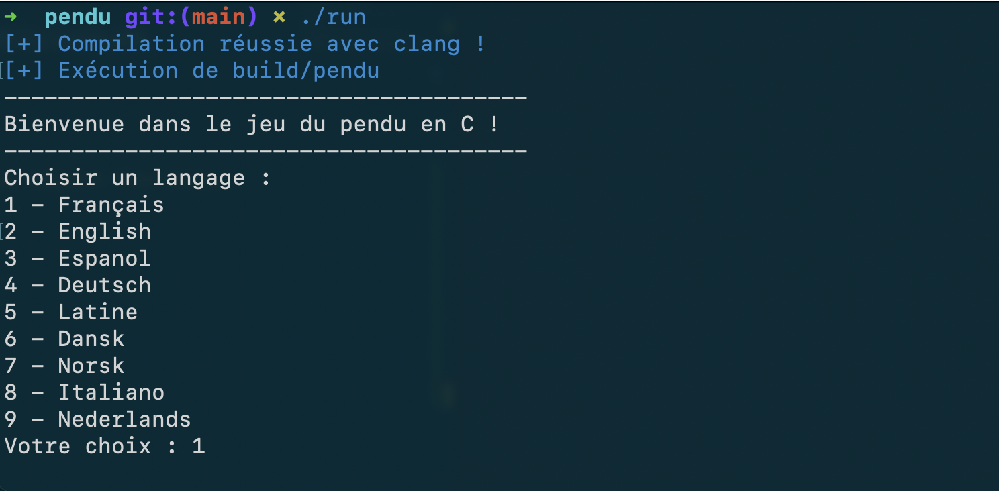
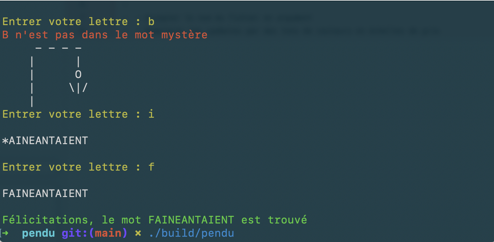

# Pendu

Simple jeu du pendu réalisé en s'inspirant d'un [TP du cours d'open Classroom](http://user.oc-static.com/pdf/14189-apprenez-a-programmer-en-c.pdf). Premier petit projet en C, realisé pour s'entraîner et apprendre.

Les listes de mots sont tirées de : http://www.3zsoftware.com/fr/listes.php 

## Compilation

Après avoir clôné ce répertoire avec

```console
git clone https://github.com/lukbrb/tutoriels.git
```

la compilation du projet s'effectue simplement via le script bash `run``

```console
cd pendu
./run
```

Le script détecte si le projet doit être compilé, ou recompilé en cas de modification, puis lance l'éxecutable. Si tout fonctionne bien, le terminal affiche ces messages



## Règles

Comme illustré sur la capture ci-dessus, le jeu peut se jouer en 9 langues. Plus précisement, lorsque le choix est *Français* le mot mystère ainsi que l'affichage sont en français. Pour les autres langues, le mot-mystère est dans la langue choisie, mais l'affichage est en anglais.

Vous ne pouvez saisir qu'une lettre à la fois. Si une lettre est répétée :

- Si cette lettre se trouve dans le mot-mystère, aucun essai n'est comptabilisé et le mot-mystère s'affichera de nouveau. Pratique pour réafficher le mot plutôt que de remonter dans le terminal.
- Si la lettre avait déjà été saisie mais ne se trouvait pas dans le mot, alors un essai sera comptabilisé. Il faut donc essayer de se souvenir des essais effectués, comme dans le jeu originel.

Si une lettre est répétée dans le mot, toutes les occurences seront révélées lorsque la lettre est saisie.

Finalement, une fin de partie gagnée ressemblera à ça



## Projets d'amélioration

Éventuels axes d'amélioration :  

1. ~Donner la possibilité de choisir la langue~  
2. Donner la possibilité de jouer en multijoueur  
3. ~Implémenter le téléchargement des listes dans d'autres langues~ Plus utile, toutes les langues sont déjà disponibles.  
4. Proposer définitions des mots en fin de jeu  

À faire : rendre la nomenclature des variables cohérente.